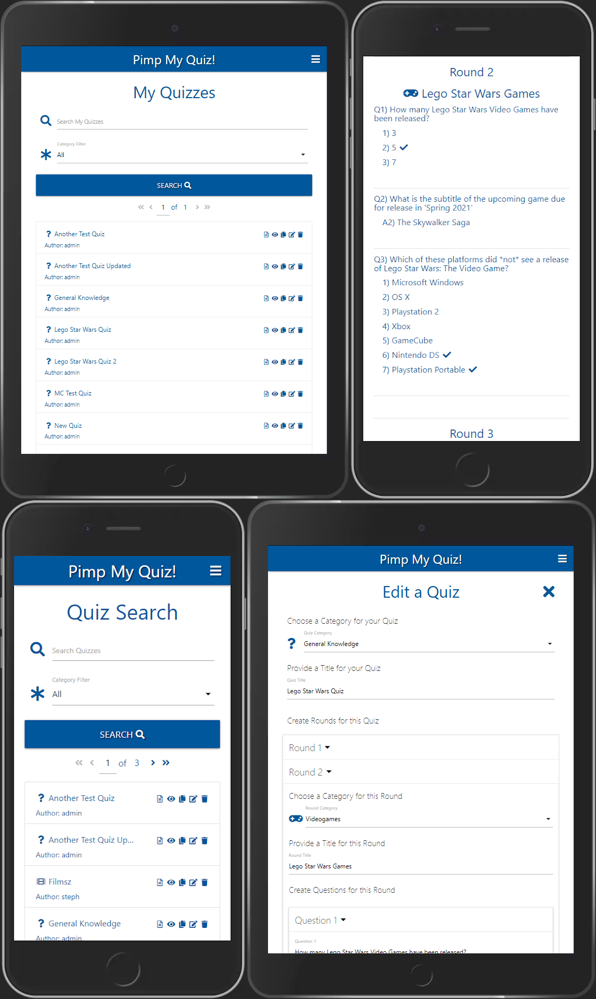
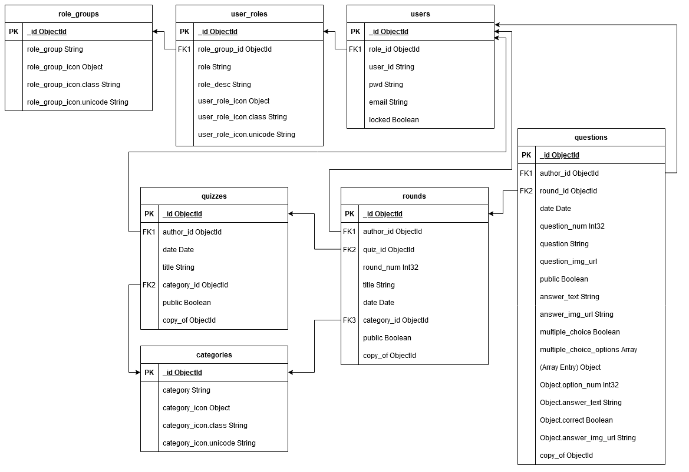

# Pimp My Quiz!

### Data Centric Development Milestone Project

Pimp my Quiz! is a website for Quiz Masters.  Users can create and edit quizzes with multiple rounds and categories.  Questions can be traditional, or multiple choice.  Pictures can be added to any question, answer or multiple choice option.  Master quiz sheets can be viewed on the site, and quiz sheets (without answers) can be shared with players via direct url - these sheets are also printable.

All content is available to our Quiz Master community, and is easily accessible via our search tool.  Any quiz can be copied to your own account and edited as you see fit.

*(An account is only required to create, edit or copy quizzes.  Quiz content is viewable by all users).
### View the live site [here](https://https://pimp-my-quiz.herokuapp.com/).

---
# Table of Contents
- [UX](#ux)
	- [Website Owner Goals](#website-owner-goals)
	- [User Goals](#user-goals)
		- [New User Goals](#new-user-goals)
		- [Returning User Goals](#returning-user-goals)
	- [User Stories](#user-stories)
		- [As a Site Owner](#as-a-site-owner)
		- [As a New User](#as-a-new-user)
		- [As a Returning User](#as-a-returning-user)
	- [Wireframes](#wireframes)
		- [Differences between the Wireframes and final design](#differences-between-the-wireframes-and-final-design)
	- [Surface](#surface)
		- [Colours](#colours)
		- [Fonts](#fonts)
		- [Images](#images)
- [Features](#features)
	- [Desired Features based on User Stories](#desired-features-based-on-user-stories)
	- [Existing Features](#existing-features)
	- [Features Left to Implement](#features-left-to-implement)
	- [Outstanding Issues](#outstanding-issues)
- [Technologies Used](#technologies-used)
- [Testing](#testing)
	- [Performance Testing](#performance-testing)
	- [Functionality Testing](#functionality-testing)
- [Notable Challenges](#notable-challenges)
	- [datagrid.js](#datagrid.js)
	- [jQuery](#jquery)
	- [JavaScript animations and dynamic scaling](#javascript-animations-and-dynamic-scaling)
- [Deployment](#deployment)
- [Credits](#credits)
	- [Content](#content)
	- [Acknowledgements](#acknowledgements)
	- [Research](#research)
- [Screenshots](#screenshots)
___
# UX
Pimp My Quiz! is an online quiz building tool.  It is simple and intuitive to use, allowing easy access to preformatted, printable quiz sheets that can be shared with players.  Quizzes created on the site are visible and copyable by all users, allowing for a vast content library with quizzes covering multiple topics.

Pimp My Quiz! has a light, minimalist design built utilising MaterializeCSS. The site is functional on desktops, laptops and mobile devices, with a minimum supported horizontal resolution of 360px.

*NB: The site will function at lower resolutions, but the page will scroll as required.*

## Website Owner Goals
My wife loves quizzes - especially creating and running them!  However, she finds it frustrating (and overly time consuming) to use traditional document writing tools and have to style everything manually, then create quiz sheets for players.  She wanted a simple online solution whereby she could login to a site, easily create a quiz of varying complexity levels, save it for future use, and provide a link to an automatically generated quiz sheet for players.

The site needed to be functional on desktop, laptop and mobile devices (although the heavy text input requirement of a quiz means that it is naturally more comfortable to use on a device with a physical keyboard).  It should not provide an online game play component - the point is to more easily facilitate traditional pen and paper based play rather than add interaction via electronic device.

The site also needed a way to share quizzes with other users via inbuilt search functionality, and the ability to copy another users quiz to your own account for editing.

## User Goals

#### New User Goals:
1. User is able to search for and view existing quizzes without requiring an account.
2. User can share a link to a player quiz sheet (does not include answers to questions).
3. User can print player quiz sheet.
4. User can log in to create a new quiz and save it for later use/editing.
5. User can log in to search for rounds created by other users and copy them to a quiz they have created.
6. User can log in to search for questions created by other users and copy them to a round in a quiz they have created.
7. User can log in to search for quizzes created by any user and copy them to their account.

#### Returning User Goals:
1. User can search for any content they have previously created, and view or edit it.

## User Stories

#### As a Site Owner:
1. I want users to be able to intuitively create a quiz.
2. I need users to be able to store their quizzes.
3. I need users to be able to view all quizzes created on the site.
4. I need users to be able to copy any quiz on the site within their own profile for use/editing.
5. I would like users to be able to print a player quiz sheet without logging in.
6. I would like users to be able to print a master quiz sheet without logging in.
7. I need to have a configurable number of Global Administrator accounts that can alter user access and edit any quiz content.
8. I need to have a configurable number of User Administrator accounts that can alter user access.
9. I need to have a configurable number of Content Administrator accounts that can edit any quiz content.
10. I would like to be able to run reports to track the provenance of any given quiz, round, or question documents.

#### As a New User:
1. I would like to be able to create a quiz in a browser.
2. I want to be able to view quizzes created by other users.
3. I would like to be able to make a copy of quizzes created by other users and edit them.
4. I need to be able to print a player quiz sheet.
5. I wish to be able to save quizzes I create for later use/editing.
6. I need to be able to print a master quiz sheet.
7. I would like to be able to search for rounds and questions that other users have created, and use them to populate a quiz.

#### As a Returning User:
1. I need be able to search for, view and edit any quizzes I have created.
2. I need quiz sheets/master quiz sheets to automatically reflect changes I make to a quiz when it is saved.

## Wireframes

Wireframes created in [Balsamiq](https://balsamiq.com/wireframes/), and exported to [/wireframes/pimpmyquiz-wireframes.pdf](wireframes/pimpmyquiz-wireframes.pdf)

# Surface
## Colours
* Background:  #ffffff
* Fonts and links:  #01579b
* Valid Highlight:  #4CAF50
* Invalid Highlight:  #F44336

## Fonts
I used the fonts configured by [MaterializeCSS](https://materializecss.com/) throughout the site.

## Images
 * Favicon created by myself using [Favicon.io](https://favicon.io/favicon-generator/)
 * Social media icons served by [Font Awesome](https://fontawesome.com/)

[Back to Table of contents](#table-of-contents)
___
# Features
The server is a Python Flask app hosted by Heroku.  The backend NoSQL database is hosted by MongoDB.
The website consists of multiple pages built from templates using [Jinja](https://jinja.palletsprojects.com/en/3.0.x/).  Most pages execute one or more AJAX calls when required, and manipulate the DOM using JavaScript in conjunction with jQuery to display the returned data.  Content is navigable via on screen options as well as a side navigation menu accessed via a burger button on the page header.  The header also features a site title which can be clicked to reload the page.  The site footer contains social media and contact links.

## Desired Features based on User Stories

1. The site must be small and lightweight.  It should avoid excessive use of images and external frameworks to keep data requirements low and performance high.
2.  Fully responsive mobile first design allows for a functional site on mobile, tablet, laptop and desktop, with a minimum. resolution of 280px x 568px.
3. User preferences should allow uploading of profile pictures, username customisation and colour selection for player tokens.
4. User preferences should be stored and automatically loaded in future sessions without additional interaction.
5. Local hotseat multiplayer to facilitate play on a single device.
6. Online multiplayer
7. User selected turn time limits allow players to decrease/increase the pressure in line with their own skill level/preferences.
8. Functional single player UI with multiple difficulty levels allowing for a solo experience.
9. Users should be able to start a game quickly with minimal interaction (less than 3 clicks).
10. Rules available to read online for players unfamiliar with the game.
11. User stat tracking allows users to monitor their progress, and find opponents of a similar skill level.10.
12. Leaderboards!

## Existing Features

1. The site must be small and lightweight.  It should avoid excessive use of images and external frameworks to keep data requirements low and performance high.
	>The site features a single page, with content manipulated via JavaScript.  The only images are the favicon and 3 social media icons (hosted by Font Awesome).  Bootstrap is utilised via bootstrap-min to reduce the footprint.

2. Fully responsive mobile first design allows for a functional site on mobile, tablet, laptop and desktop, with a minimum width of 280px, and minimum height of 568px.
	>The site was designed mobile-first, and dynamically scales up to higher resolutions. The game renders and plays perfectly on modern mobile devices, which is the ideal way to play.

3. User preferences should allow uploading of profile pictures, username customisation and colour selection for player tokens.
	>Due to technological limitations it was not possible to create a full user profile based experience.  However users can alter usernames and colour selection for both players, and these values are written to local storage.  The chosen colour mode for the site  - Dark (default) or Light is also stored, along with the selected Turn Time Limit.

4. User preferences should be stored and automatically loaded in future sessions without additional interaction.
	>Stored preferences (Usernames, colours, turn time limit, and colour mode) are applied automatically when the site loads.

5. Local hotseat multiplayer to facilitate play on a single device.
	>1. This feature is fully functional. In just 2 clicks, players can be in game.
	>2. A game can be paused/resumed/reset at any time.
	>3. If left to run without user interaction, each time a player fails to take an action during their turn, the game will automatically insert a token for that player into a random column.
	>4. Once a win/draw has been determined, a rematch can be started (using the same turn time limit) directly from the game screen.

6. User selected turn time limits allow players to decrease/increase the pressure in line with their own skill level/preferences.
	>Time limits can be set in increments of 5 seconds, starting with the default of 5 to a maximum of 30.

7. Users should be able to start a game quickly with minimal interaction (less than 3 clicks).
	>Using the default settings, a player can get into a game with just 2 clicks ('Start Game'->'Ok').

8. Rules available to read online for players unfamiliar with the game.
	>The rules are available to read from the side menu, or directly from the main page.

## Features Left to Implement

1. Rules display during game play
	>I would like to add a feature to display the rules in a pop-up whilst the game is paused. Currently the rules are not accessible during game play.

2. Single Player AI
	>I would like to add a single player AI. Unfortunately this moved out of scope due to time constraints.

3. Online Multiplayer, Leaderboards/Stat Tracking
	>I would like to add Online Multiplayer, with Leaderboards and player stat tracking. This will require a more comprehensive backend with database functionality that was not available for this project.

4. User Accounts with personalised settings (such as uploading profile pictures)
	>I would like to add a User Account system. This will assist with Leaderboards/Stat Tracking, and will also allow players to save their name/colours and a profile picture for use on multiple devices/browsers. This would also require a backend database.

## Outstanding Issues

1. When viewing the site through browser dev tools, changing the device or directly altering the device resolution can lead to rendering inconsistencies.
	>Changing the device or directly altering the resolution values within dev tools does not seem to consistently trigger onresize, or consistently apply media queries.  Any rendering inconsistencies can be resolved by refreshing the page.

[Back to Table of contents](#table-of-contents)
___
# Technologies Used

* [Python](https://www.python.org)
	- Python was linted with [autopep8](https://pypi.org/project/autopep8/) within **VSCode**.
	- [Flask](https://flask.palletsprojects.com/en/2.0.x/)
		* The server is a **Flask** app
	- [Jinja](https://jinja.palletsprojects.com/en/3.0.x/)
		* HTML Templates are built using **Jinja**
	- [Flask-pyMongo](https://flask-pymongo.readthedocs.io/en/latest/)
		* Bridges **Flask** with **MongoDB**
	- [Werkzeug](https://pypi.org/project/Werkzeug/)
		* Used to handle password hash generation and checks
* [HTML5](https://en.wikipedia.org/wiki/HTML5/)
	- HTML was validated using [validator.w3.org](https://validator.w3.org/nu/)
* [CSS3](https://en.wikipedia.org/wiki/Cascading_Style_Sheets/)
	- CSS was validated using [jigsaw.w3.org](https://jigsaw.w3.org/css-validator/)
* [JavaScript](https://javascript.com)
	- JavaScript was linted with [ESLint](https://eslint.org/) within **VSCode**.
	- [jQuery](https://jquery.com)
		* The project utilises the **jQuery** JavaScript library.
* [MaterializeCSS](https://materializecss.com/)
	- The project uses the **MaterializeCSS** framework.
* [Font Awesome](https://fontawesome.com/)
	- The project uses **Font Awesome** for social media icons.
* [Git](https://git-scm.com/)
	- **Git** was used for version control.
* [GitHub](https://github.com)
	- I used the [Code Institute template](https://github.com/Code-Institute-Org/gitpod-full-template) to create a **GitHub** repo.
* [VSCode](https://code.visualstudio.com)
	- The project was written entirely in **VSCode**.
* [Draw.io](https://app.diagrams.net/)
	- Used to create the database diagram.
* [GNU Image Manipulation Program (GIMP)](https://www.gimp.org/)
	- Used to create images for this readme.

[Back to Table of contents](#table-of-contents)
___
# Testing

All testing was conducted manually, making extensive use of Dev Tools within Mozilla Firefox, Google Chrome and Microsoft Edge.

## Functionality Testing
Devices tested in browser dev tools include:
>Pixel 2
>Galaxy S5
>Moto G4
>iPhone 6/7/8
>Surface Duo
>iPhone 6/7/8 Plus
>Galaxy S9/S9+/S10e
>iPhone X/XS
>Pixel 2 XL
>720p Screens
>1080p Screens
>4k Screens

Devices physically tested include:
>Galaxy S8
>Galaxy S10/S10e
>Galaxy Tab A 10.1 2019
>1080p Screens
>4k Screens

The minimum supported width is 280px, and the minimum supported height is 568px.
Testing was performed using the following flowcharts:

1. Logo Animation
	[logo-animation.pdf](wireframes/c4-logo-animation.pdf)

2. Rules
	[rules.pdf](wireframes/c4-rules.pdf)

3. User Settings
	[user-settings.pdf](wireframes/c4-user-settings.pdf)
	[user-settings-validation-alert.pdf](wireframes/c4-user-settings-validation-alert.pdf)

4. Side Navigation Menu:
	[sidenav.pdf](wireframes/c4-sidenav.pdf)

5. Start a Game
	[start-game.pdf](wireframes/c4-start-game.pdf)

[Back to Table of contents](#table-of-contents)
___
# Notable Challenges

## Database Design

## AJAX

The design of the site necessitated being able to retrieve paginated results without reloading entire web pages.  This is not possible with a typical POST request, so I implemented xHTTP (AJAX) functions.  Despite using JQuery for much of the site, I did rely on JavaScript for much of these xHTTP functions.  Having not made use of AJAX previously, I wanted to become familiar with it without relying on jQuery shortcuts.

As my results were to include active links and MaterializeCSS Tooltips, I also needed to find a way to enable/disable event listeners attached to these elements.  The answer was to utilise Mutation Observers attached to the results data containers which would initialise listeners and MaterializeCSS functions when the innerHTML property once results were loaded.

##  jQuery

As I had never worked with jQuery before, I wanted to become as familiar with it as possible. Therefore I made the decision to use jQuery extensively for this project.

[Back to Table of contents](#table-of-contents)
___
# Database Diagram

# Deployment

## Database

The project uses a MongoDB back-end for data storage.

* The database was created manually using the MongoDB web interface - Atlas.
	1. Log into [MongoDB](https://cloud.mongodb.com)
	2. Create a cluster (Use AWS as the provider and choose a region appropriate server location)
	3. Choose an appropriate Tier (I chose the free M0 tier for this project)
	4. Give the cluster a name
	5. Click on 'Create Cluster'
	6. In the Security section to the left of the page, click on 'Database Access'
	7. Click 'Add New Database User', and provide a username and password. (The password should consist of upper/lowercase letters and numbers only)
	8. Ensure 'Database User Privileges' are set to 'Read and write to any database'
	9. Click 'Add User'.
	10. Back in the Security section, click on 'Network Access'
	11. Click 'Add IP Address'
	12. Click 'Allow Access From Anywhere'
	13. Click 'Confirm'
	14. In the Data Storage section, click on 'Clusters'
	15. Once provisioning is complete, click on the 'Collections' button
	16. Click 'Add My Own Data'
	17. Provide a name for the database, and the first collection ('pimp_my_quiz' and 'users' respectively), then click 'Create'
	18. Once the database is created, click the 'Create Collection' button to add another collection.
	19. Collections will be added one at a time.  In addition to 'users' we require user_roles, role_groups, categories, quizzes, rounds and questions
	20. Click on the 'role_groups' collection, then click 'Insert Document'
	21. A role_group document has the following fields:
		* _id (objectId)
		* role_group (string)
		* role_group_icon (object):
			* class (string)
			* unicode (string)
	22. The first role_group will have a role_group of 'Administrators Group', a class of 'fa-users-cog' and a unicode of 'f509'
	23. Click 'Insert'
	24. Create another role_group in the same format, with a role_group of 'Users Group', a class of 'fa-users' and a unicode of 'f0c0'
	25. Take copies of the role_group _id value for both role_group documents
	26. Click on the 'user_roles' collection, then click 'Insert Document'
	27. A user_role document has the following fields:
		* _id (objectId)
		* role_group_id (objectId)
		* role (string)
		* role_desc (string)
		* role_icon (object):
			* class (string)
			* class (string)
	28. The first role_group will have a role_group_id of the value copied from the 'Administrators Group', a role of 'Global Admin', a role_desc of 'Global Administrator Role', a class of 'fa-user-secret' and a unicode or 'f21b'
	29. The first role_group will have a role_group_id of the value copied from the 'Administrators Group', a role of 'Content Admin', a role_desc of 'Content Administrator Role', a class of 'fa-user-ninja' and a unicode or 'f504'
	30. The third role_group will have a role_group_id of the value copied from the 'Administrators Group', a role of 'User Account Admin', a role_desc of 'User Account Administrator Role', a class of 'fa-user-tie' and a unicode or 'f508'
	31. The fourth and final role_group will have a role_group_id of the value copied from the 'Users Group', a role of 'User', a role_desc of 'User Role', a class of 'fa-user' and a unicode or 'f007'
	32. Click on the 'categories' collection, then click 'Insert Document'
	33. A category document has the following fields:
		* _id (objectId)
		* category (string)
		* category_icon (object):
			* class (string)
			* unicode (string)
	34. The first category will have a category of 'General Knowledge', a class of 'fa-question' and a unicode of 'f128'
		* *NB: The 'General Knowledge' class should be considered compulsory*
	35. The second category will have a category of 'Music', a class of 'fa-music' and a unicode of 'f001'
	36. The third category will have a category of 'Television', a class of 'fa-tv' and a unicode of 'f26c'
	37. The fourth category will have a category of 'Movies', a class of 'fa-film' and a unicode of 'f008'
	38. The fifth category will have a category of 'Sport', a class of 'fa-futbol' and a unicode of 'f1e3'
	39. The sixth category will have a category of 'Theatre', a class of 'fa-theater-masks' and a unicode of 'f630'
	40. The seventh and final category will have a category of 'Videogames', a class of 'fa-gamepad' and a unicode of 'f11b'

	*All of the class and unicode values are [Font Awesome](https://fontawesome.com) icon class names/unicode values.*

### Create Database Indexes

* The indexes were created manually using the MongoDB web interface - Atlas.
	1. Log into [MongoDB](https://cloud.mongodb.com)
	2. In the Data Storage section, click on 'Clusters'
	3. Click on the 'Collections' button
	4. Click on the 'Search' tab
	5. Click on the 'Create Search Index' button
	6. Click 'Next'
	7. Give the index a name
	8. Select the 'users' collection
	9. Click 'Next'
	10. Click 'Create Search Index'
	11. Click 'Close' to clear the message on screen
	12. Click the 'Create Index' button
	13. Click 'Next'
	14. Give the index a name
	15. Select the 'quizzes' collection
	16. Click 'Next'
	17. Click 'Create Search Index'
	18. Click 'Close' to clear the message on screen once again

## Site

The project was developed using [VSCode](https://code.visualstudio.com/). There are no differences between the developed and deployed versions, and no additional code branches. Changes saved in **VSCode** were committed and pushed to **GitHub** frequently throughout the development process via the **Source Control** tool within **VSCode**.  I also made use of the [GitLens](https://gitlens.amod.io/) **VSCode** addon.

### Pre-deployment

* Before deployment, I ran the following from the command line to create requirements.txt and Procfile, both of which are required by the host:

	1. pip3 freeze --local > requirements.txt
	2. echo web: python app.py > Procfile
		* *Open the Procfile with an editor such as [VSCode](https://code.visualstudio.com/) and delete any blank lines at the bottom of the file, then save it.*
	3. git add requirements.txt
	4. git commit -m "Add requirements.txt"
	5. git add Procfile
	6. git commit -m "Add Procfile"
	7. git push

### Site Deployment

* I deployed the project to Heroku using the following method:
	1. Log into Heroku and select 'New', then [Create New App](https://dashboard.heroku.com/new-app)
	2. Give the app a name, select an appropriate region, and click 'Create App'
	3. You will be taken to the deployment page for the new app
	4. Click on the 'Settings' tab at the top of the page, then 'Reveal Config Vars'
	5. Create a key called IP with a value of 0.0.0.0, then click 'Add'
	6. Create a key called PORT with a value of 5000, then click 'Add'
	7. Open another browser tab and navigate to [RandomKeygen.com](https://randomkeygen.com)
	8. Copy one of the Fort Knox passwords
	7. Go back to your Heroku tab and create a key called SECRET_KEY, then paste the password as the value and click 'Add'
	8. Open another browser tab and log in to [MongoDB](https://cloud.mongodb.com)
	9. Click 'Clusters' then the 'Connect' button, then 'Connect your application'
	10. Change the Driver to 'Python' and the Version to '3.1.1 or later'
	11. Copy the connection string
	12. Go back to your Heroku tab and create a key called MONGO_URI, then paste the connection string as the value
	13. Edit the MONGO_URI value, and replace <password> and myFirstDatabase with your Database Access password and the name of your Database
	14. Click 'Add'
	15. Create a key called MONGO_DBNAME with a value of the database name (in this case, pimp_my_quiz), then click 'Add'
	16. Click on the 'Deploy' tab at the top of the page
	17. Change the Deployment method to GitHub
	18. Choose the 'Pimp My Quiz!' repository (in this case, BWeeks101/pimpmyquiz)
	19. Choose the deployment branch (in this case, 'Master')
	20. Click 'Enable Automatic Deploys'
	21. Click 'Deploy'
	22. Watch the deployment progress at the bottom of the page for the deployment confirmation

* To deploy locally:
	1. Log into GitHub and open the [Pimp My Quiz!](https://github.com/BWeeks101/pimpmyquiz) repository.
	2. Select 'code' then 'Download ZIP'.
	3. Extract the contents of the ZIP file for use in your own environment.
		- Alternatively you can [Clone](https://docs.github.com/en/github/creating-cloning-and-archiving-repositories/cloning-a-repository) or [Fork](https://docs.github.com/en/github/getting-started-with-github/fork-a-repo) the [Pimp My Quiz!](https://github.com/BWeeks101/pimpmyquiz) repository into your own GitHub account.
	4. Create an env.py file in the root of your local repository containing the following lines:
		* import os
		* os.environ.setdefault("IP", "0.0.0.0")
		* os.environ.setdefault("PORT", "5000")
		* os.environ.setdefault("SECRET_KEY", "")
		* os.environ.setdefault("MONGO_URI", "")
		* os.environ.setdefault("MONGO_DB", "")
	5. Go to [RandomKeygen.com](https://randomkeygen.com) and copy one of the Fort Knox Passwords.
	6. Paste the password as the value of the SECRET_KEY key
	7. Log in to [MongoDB](https://cloud.mongodb.com)
	8. Click 'Clusters' then the 'Connect' button, then 'Connect your application'
	9. Change the Driver to 'Python' and the Version to '3.1.1 or later'
	10. Copy the connection string
	11. Paste the connection string into as the value of the MONGO_URI key
	12. Edit the MONGO_URI value, and replace '<password>' and 'myFirstDatabase' with your Database Access password and the name of your Database respectively
	13. Add the name of your Database as the MONGO_DB key value
	14. Save and close the env.py
	15. Ensure env.py is listed in your .gitignore file to prevent committing this file - it is for use in your local deployment ONLY.

### Post Deployment

Navigate to your Pimp My Quiz! url and register a user account.  This account will be your initial Global Administrator account, so pick a suitable name and password.

* Once the account is created:
	1. Log in to [MongoDB](https://cloud.mongodb.com)
	2. Click 'Clusters' then the 'Collections' button
	3. Select the 'user_roles' cluster
	4. Locate the 'Global Admin' role, and copy the contents of the ObjectId in the _id field
	5. Select the 'users' cluster
	6. Locate the account that you wish to use as your Global Administrator account
	7. Double-click the ObjectId value in the role_id field to edit it.
	8. Delete the contents of the field, and paste the ObjectId value that you copied from the 'Global Admin' role
	9. Click 'Update' to save the changes
	10. Navigate back to your Pimp My Quiz! login page, and login with the user you created.
	11. You should now see the 'User Admin' link in the Nav bar and on the sideNav.
	12. You can configure any future administrator accounts from this console.

#### Administrator Roles

* Global Administrator Role
	- Members can alter any type of user account in the system, and any quiz content.
	- Ensure that these accounts are only granted to highly trusted individuals.
* User Administrator Role
	- Members can alter any Content Administrator or User accounts.
	- These accounts should be restricted to trusted users who will perform password resets/lock/unlock accounts, change email addresses etc.
* Content Administrator Role
	- Members can alter any quiz content.
	- These accounts should be restricted to trusted users who will be responsible for moderating quiz content and removing offensive material etc.

[Back to Table of contents](#table-of-contents)
___
# Credits

* Code Institute [Gitpod Template](https://github.com/Code-Institute-Org/gitpod-full-template)
* Flex based 'Sticky Footer from [CSS-Tricks](https://css-tricks.com/couple-takes-sticky-footer/)
* I utilised a workaround proposed by [Alec Rust](https://stackoverflow.com/users/312681/alecrust) on [Stack Overflow](https://stackoverflow.com/) to [add colour samples](https://stackoverflow.com/questions/11509830/how-to-add-color-to-githubs-readme-md-file/41247934#41247934) to the [Surface](#surface) section of this readme.

## Content

All text content written by myself.

## Acknowledgements

I received inspiration for this project from my wife and our friends, who have spent far too much time building quizzes delivered via Zoom during the Covid-19 pandemic!

## Research:

* [Code Institute](https://codeinstitute.net/) course material and example projects.
*  [Python](https://docs.python.org/3/) documentation.
*  [PEP 8 Style Guide](https://www.python.org/dev/peps/pep-0008/).
*  [Flask](https://flask.palletsprojects.com/en/2.0.x/) documentation.
*  [Jinja](https://jinja.palletsprojects.com/en/3.0.x/) documentation.
*  [pyMongo](https://pymongo.readthedocs.io/en/stable/) documentation.
*  [Flask-pyMongo](https://flask-pymongo.readthedocs.io/en/latest/) documentation.
*  [jQuery](https://api.jquery.com/) documentation.
* W3C Schools [CSS](https://www.w3schools.com/css/default.asp/), [HTML](https://www.w3schools.com/html/default.asp/), [JavaScript](https://www.w3schools.com/js/DEFAULT.asp), [jQuery](https://www.w3schools.com/jquery/) and [Python](https://www.w3schools.com/python/) documentation.
*  [MaterializeCSS](https://materializecss.com/) documentation.
* MDN web docs ([JavaScript](https://developer.mozilla.org/en-US/docs/Web/javascript), [CSS](https://developer.mozilla.org/en-US/docs/Web/CSS/), and [HTML](https://developer.mozilla.org/en-US/docs/Web/HTML/)).
*  [CSS-Tricks.com](https://css-tricks.com/)
*  Password Confirmation code modified from [https://jsfiddle.net/SirusDoma/ayf832td/](https://jsfiddle.net/SirusDoma/ayf832td/) by [Sirus Doma](https://jsfiddle.net/user/SirusDoma/fiddles/)
*  [Stack Overflow](https://stackoverflow.com/)*

*It is almost impossible to search for any coding related issue online without encountering Stack Overflow links towards the top of the results. Whilst I certainly read Stack Overflow when researching solutions to challenges, I have not (to the best of my recollection or per my notes) utilised any code directly, in whole or in part, (with the exception of the workaround for this readme listed in the [credits](#credits) above).

[Back to Table of contents](#table-of-contents)
___
# Screenshots
