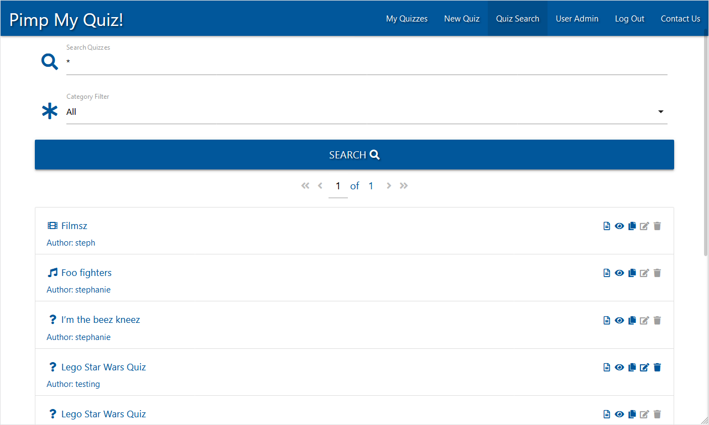

# Pimp My Quiz!

### Data Centric Development Milestone Project Testing

All testing was conducted manually, making extensive use of Dev Tools within Mozilla Firefox, Google Chrome and Microsoft Edge.

## Functionality Testing
* Tested with:
    - Browser Dev Tools (Chrome, Firefox, Edge)
    - Galaxy S8 (Chrome, Firefox Mobile)
    - Galaxy S10/S10e (Chrome, Firefox Mobile)
    - iPhone X (Safari)
    - Galaxy Tab A 10.1 2019 (Chrome, Firefox Mobile)
    - 1080p Screens (Chrome, Firefox, Edge)
    - 4k Screens (Chrome, Firefox, Edge)

1. Fully responsive design allows for a functional site on mobile, tablet, laptop and desktop, with a minimum width 360px.
    * The minimum supported width is 360px.  Below this, content will scroll horizontally.
    * The site is fully responsive at all resolutions I have personally tested (360px > 4096px).
    * The site is compatible with the following browsers:
        - Chrome
        - Firefox
        - Edge
    * The site is compatible with the following mobile browsers:
        - Chrome
        - Firefox
        - Safari

2. Quizzes should allow the linking of images as well as text.
    * Every question, answer and multiple choice option input is paired with a url input to allow linking to images
        - Every question, answer and multiple choice option may have either text content, an image url, or both.
        
    * Any round meeting the following criteria will be treated as a Picture Round on the Player Quiz Sheet:
        - More than one question
        - No questions may be multiple choice
        - No questions may have question text
        - All questions must have an image url
    * Picture Round styling will adjust to fit multiple images on a single row.

3. Quizzes should allow the opportunity to create multiple choice questions.
    * Every question features a 'Multiple Choice?' checkbox which can be toggled to switch a question between single answer/multiple choice.
    

4. Quizzes should be saved online so that they can be edited or deleted at a later date.
    * When saved, a quiz is stored in mongoDB and associated with a user account.
    * Quizzes can be edited or deleted by the author, or by a Global Administrator or Content Administrator.
    * Quizzes will persist in the database until they are manually deleted.
    * Once they have logged in, users have access to edit or delete any quiz associated with their account.
    

5. Quizzes should be discoverable via title and category.
    * The 'Quiz Search' and 'My Quizzes' page allow users to search by quiz title and filter results by category.
    * If the search input is left blank, a '*' wildcard search will be performed, returning all results for the selected category.
    

6. Users should be able to view and print master and player quiz sheets.
    * Player Quiz Sheets (/quiz_sheet?&id=[objectId]) are accessible by any site visitor, without requiring them to be logged in.
    * Master Quiz Sheets (/view_quiz?&id=[objectId]) are accessible by any site visiter, without requiring them to be logged in.
        - If a user is logged in when viewing a Master Quiz Sheet, they will see a link in the top right corner allowing them to take a copy of the quiz.
        
    * style.css features a media print query affecting elements on both pages, enhancing their printed output

7. Users should be able to make a duplicate of any quiz for editing within their own account.
    - From the search results on either the 'My Quizzes' page or the 'Quiz Search' page, a logged in user can click on the 'Copy Quiz' link to have a copy of any Quiz saved to their account.
    - If the user already has a Quiz with the same title, they will be prompted to change the title of the copy before it is created.
    - Once a user is logged in, a Copy Quiz link is also available in the top right corner of the Master Quiz Sheet ('View Quiz' page).  This works in exactly the same way, including prompting for a title change when required.
        
    - Once a user has created a copy of a Quiz, they have full access to edit or delete that copy.

8. Global Administrator accounts should have full access to alter any user account and any quiz content.
    - Global Administrator users have access to the User Administration Console (/admin_users).
    - From here, they have access to all user accounts on the system.
    
    - Global Admins can alter the properties of any user account without restriction.
    
    - Global Admins can use the standard 'Quiz Search' page to directly edit or remove Quizzes for any user.
    

9. User Account Administrator accounts should have full access to alter any user account that is a member of the Content Administrator or User roles.
    - User Account Administrator users have access to the User Administration Console (/admin_users).
    - From here, they have access to all Content Administrator Role and User Role member accounts.
    
    - User Account Admins can alter the properties of any user account they have access to.
    - When editing a user account, User Account Admins only have access to select the 'Content Administrator' or 'User' roles.
    
    - User Account Admins have no additional access to alter Quiz content.
    

10. Global and User Account Administrators should be able to discover user accounts by Username and/or Email address.
    - The User Administration Console (/admin_users) features a search function that can be used to locate users by username or email address
    - Wildcard searches are supported
    

11. Content Administrator accounts should have full access to alter/delete any quiz content on the site.
    - Content Administrator users can use the standard 'Quiz Search' page to directly edit or remove Quizzes for any user.
    - Content Admins do not have access to the User Administration Console (/admin_users)
    

12. User Role member accounts should only be able to alter/delete quiz content within their own account.
    - User Role members do not have access to edit/delete any quiz associated with another user - the client receives styled spans in place of the necessary links from the server.
    

*All user/administrator actions are authenticated defensively by the server application.  Unauthorised requests are handled, denied and/or redirected*

13. Quiz Sheets/Master Quiz Sheets should reflect any changes made to a Quiz when the quiz is saved.
    - Quiz Sheets and Master Quiz Sheets are build dynamically from the appropriate quiz data stored on the backend.
    - If a change is made to a quiz (and saved), reloading a Quiz Sheet or Master Quiz Sheet for that quiz will reflect any changes.

## User Story Testing

1. * *As a Site Owner* I want users to be able to intuitively create a quiz.
    * *As a New User* I would like to be able to create a quiz in a browser.
        - Once logged in, a user can click on the 'New Quiz' link on the Navbar or sideNav.
        - The user can then utilise the elements on this page to build a quiz.
        - Clicking the 'Save Quiz' button at the bottom of the page will save it to their account for future use.
        
        - Text/URL Inputs have helper elements, which display when the content of the input is missing or invalid.  These assist the user to properly complete their quiz.
        
        - Multiple Choice Options can be flagged as 'Correct' by use of their own check box.
            - Each Multiple Choice question must have at least 1 correct or incorrect option.
            
            
            - Marking all options as either correct or incorrect will produce a validation error
            
            
        - When the user clicks the 'Save Quiz' button, the quiz data is validated before submission to the server.
            - If any input or checkbox is invalid, it will be underlined in red.  Text/URL input helpers will be displayed where appropriate.
            - Any questions that validate successfully will be collapsed.
            - Any rounds that validate successfully will be collapsed.
            - Only rounds and questions that contain at least one invalid input be expanded.
            
            
            - Once the entire quiz has been validated, if any invalid inputs are detected, the page is scrolled to the first such input and an explanation is displayed on the screen.
            
            - Once all invalid inputs are corrected, the quiz will save successfully.
            - Once saved a Flash message will appear at the top of the screen notifying the user, and the quiz will be opened for editing so that the user can continue working on it if they wish.
            

2. * *As a Site Owner* I need users to be able to store their quizzes.
    * *As a New User* I wish to be able to save quizzes I create for later use/editing.
        - When a user creates or copies a quiz, it is saved to the database and associated with the users account.
        - Quizzes will persist in the database until they are manually deleted.
        - Once they have logged in, users have access to edit or delete any quiz associated with their account.
        

3. * *As a Site Owner* I need users to be able to view all quizzes created on the site.
    * *As a New User* I want to be able to view quizzes created by other users.
        - Users are able to search for and view all quizzes on the site via the Quiz Search page.
            - The /quiz_search route is mapped by default for users who are not logged in.
        - From this page, users can search by Quiz Title and filter by Category
        - From the search results, users can click the 'View Quiz' link to open the Master Quiz Sheet, or the 'Quiz Sheet' link, to open the Player Quiz Sheet.  Either link can be shared and is fully accessible without logging in.
        

4. * *As a Site Owner* I need users to be able to copy any quiz on the site within their own profile for use/editing.
    * *As a New User* I would like to be able to make a copy of quizzes created by other users and edit them.
        - From the search results on either the 'My Quizzes' page or the 'Quiz Search' page, a logged in user can click on the 'Copy Quiz' link to have a copy of any Quiz saved to their account.
        - If the user already has a Quiz with the same title, they will be prompted to change the title of the copy before it is created.
        - Once a user is logged in, a Copy Quiz link is also available in the top right corner of the Master Quiz Sheet ('View Quiz' page).  This works in exactly the same way, including prompting for a title change when required.
        
        
        - Once a user has created a copy of a Quiz, the have full access to edit or delete that copy.

5. * *As a Site Owner* I would like users to be able to print a player quiz sheet without logging in.
    * *As a New User* I need to be able to print a player quiz sheet.
        - From the search results on either the 'My Quizzes' page or the 'Quiz Search' page, users can click the 'Quiz Sheet' link, to open the Player Quiz Sheet (which does not display answers).
        - This link can be shared, and is fully accessible without logging in.
        - style.css contains a media print rule to enhance the printed output.

6. * *As a Site Owner* I would like users to be able to print a master quiz sheet without logging in.
    * *As a New User* I need to be able to print a master quiz sheet.
        - From the search results on either the 'My Quizzes' page or the 'Quiz Search' page, users can click the 'View Quiz' link to open the Master Quiz Sheet.
        - This link can be shared, and is fully accessible without logging in.
        - style.css contains a media print rule to enhance the printed output.

7. * *As a Site Owner* I need to have a configurable number of Global Administrator accounts that can alter user access and edit any quiz content.
        - Global Administrator users have access to the User Administration Console (/admin_users).
        - From here, they have access to all user accounts on the system.
        
        - Global Admins can alter the properties of any user account without restriction.
        
        - Global Admins can use the standard 'Quiz Search' page to directly edit or remove Quizzes for any user.
        

8. * *As a Site Owner* I need to have a configurable number of User Administrator accounts that can alter user access.
        - User Account Administrator users have access to the User Administration Console (/admin_users).
        - From here, they have access to all Content Administrator Role and User Role member accounts.
        
        - User Account Admins can alter the properties of any user account they have access to.
        - When editing a user account, User Account Admins only have access to select the 'Content Administrator' or 'User' roles.
        
        - User Account Admins have no additional access to alter Quiz content.
        

9. * *As a Site Owner* I need to have a configurable number of Content Administrator accounts that can edit any quiz content.
        - Content Administrator users can use the standard 'Quiz Search' page to directly edit or remove Quizzes for any user.
        - Content Admins do not have access to the User Administration Console (/admin_users)
        

10. * *As a Returning User* I need be able to search for, view and edit/delete any quizzes I have created.
        - Once logged in, users are redirected to the 'My Quizzes' page (/my_quizzes)
        - Here, users can search for, view, edit or delete any/all quizzes they have created.
        

11. * *As a Returning User* I need quiz sheets/master quiz sheets to automatically reflect changes I make to a quiz when it is saved.
        - Quiz Sheets and Master Quiz Sheets are build dynamically from the appropriate quiz data stored on the backend.
        - If a change is made to a quiz (and saved), reloading a Quiz Sheet or Master Quiz Sheet for that quiz will reflect any changes.

